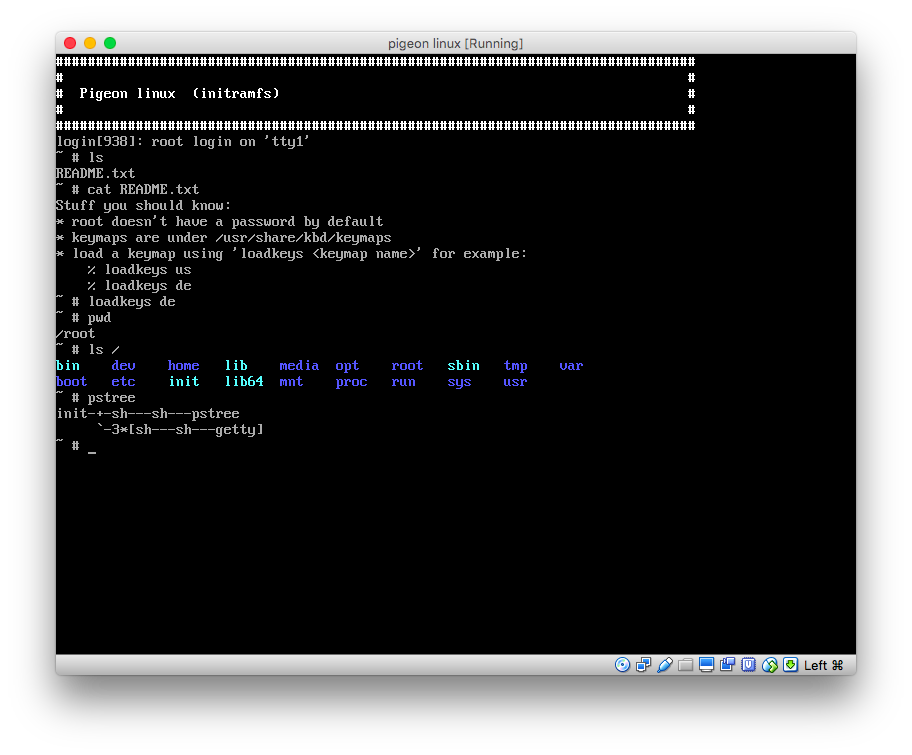

# pigeon_linux

A busybox based linux distribution build from scratch, as light as a pigeon.

It currently features busybox, ubase, sinit, dosfstools and keyboard layouts.

Inspired by [minimal linux](https://github.com/ivandavidov/minimal)

# Build Dependencies
* genisoimage
* cpio (initramfs generation)
* All tools to needed to compile the linux kernel and glibc
* standard dev tools

# Build It
```bash
git clone https://github.com/bauen1/pigeon_linux pigeon_linux
cd pigeon_linux
make all
make qemu
```
